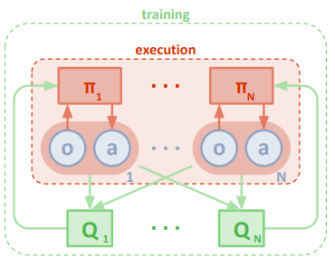
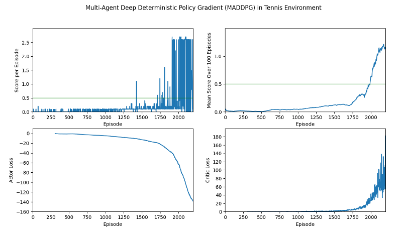

# Project Report

Author: Michael Aeberhard

This report summarizes the results of the third project, _Collaboration and Competition_, of the Udacity Deep
Reinforcement Learning Nanodegree.

- [Project Report](#project-report)
  * [The Tennis Environment](#the-tennis-environment)
  * [Multi-Agent Reinforcement Learning](#multi-agent-reinforcement-learning)
    + [Multi-Agent Actor-Critic](#multi-agent-actor-critic)
    + [Shared Actor and Critic Networks](#shared-actor-and-critic-networks)
    + [Collaboration Reward Scheme for Tennis Environment](#collaboration-reward-scheme-for-tennis-environment)
  * [Project Implementation Details](#project-implementation-details)
    + [Source Code Organization](#source-code-organization)
    + [Neural Network Architecture](#neural-network-architecture)
    + [Hyperparameters](#hyperparameters)
  * [Training Results](#training-results)
  * [Ideas for Future Work](#ideas-for-future-work)

## The Tennis Environment

For this project, two agents are trained to play a game of tennis, where the goal of the game is the keep the ball in
play for as long as possible. A reward of +0.1 is given to an agent if it hits the ball with the racket over the net.
A reward of -0.01 is given to the agent if the ball goes either out-of-bounds or it hits the ground. Each agent
receives its own local input observations which correspond to the position and velocity and the ball and racket and is
able to output two continuous actions with ranges between [-1, 1] which represent the movement of the racket to the
left and the right, and a jump action of the racket.

The environment is considered solved with one of the two agents received an average reward of +0.5 over 100 consecutive
episodes.

## Multi-Agent Reinforcement Learning

The challenge in this project lies in the fact that the environment has two, i.e. multiple, agents which interact in
the same environment. This results in the fact that each agent's actions has an influence on the other agent's state,
and therefore their actions as well. Applying a standard reinforcement learning algorithm to each agent independently
does not work well in practice, as this result in a non-stationary environment. A different algorithm needs to be
applied which considers the dependence between the agents in the environment, and that is the goal of multi-agent
reinforcement learning.

### Multi-Agent Actor-Critic

The paper [Multi-Agent Actor-Critic for Mixed Cooperative-Competitive Environments](https://arxiv.org/abs/1706.02275)
presents a slightly modified version of the
[Deep Deterministic Policy Gradient (DDPG)](https://arxiv.org/abs/1509.02971) actor-critic method for multi-agent
cooperative and competitive environments called Multi-Agent Deep Deterministic Policy Gradient (MADDPG).

The paper proposes an architecture as shown in the figure above, where the main difference lies in the fact that the
critic networks are able to receive the additional state and action information from the other agents in the environment
for the purpose of training. The actor networks for each agent still remain independent, which allows them to still
execute their actions with only the local information of each agent, avoiding any need for any communication between
agents in the environment. In practice, the states and actions of all of the agents are concatenated together and
given as input to each agent's critic network. Each agent has their own critic network due to the fact that each agent
might have a slightly different reward function in order to realize different behaviors of the agents in the
environment. Typically a shared replay experience buffer is used, which records the experience tuples for all of the
agents in a single entry, since the critic networks require state and action information from all agents during
training.

### Shared Actor and Critic Networks

For the tennis environment, since each agent receives their own local observation, and each agent has the same goal of
keeping the ball in play, it is possible to use just a single actor and critic network for both agents. It was found
that this method works similarly well compared to each agent having its own actor and critic network, and is even
able to converge faster to a solution during training. Training is achieved by updating the shared actor and critic
networks twice for each environment's experience tuple, once for each agent.

### Collaboration Reward Scheme for Tennis Environment

Since the goal of the tennis environment is to keep the ball in play, it can be argued that he agents are in a
collaborative, i.e. cooperative, environment, and the reward function for the agents should reflect this fact.
Specifically for the tennis environment, the critic is trained with the sum of the rewards from both agents, such that
when an agent is successful at hitting the ball over the net, that state of the environment (and all agent actions)
is rewarded for both agents positively, encouraging similar actions in the future. This scheme was motivated by the
implementation from GitHub user [shartjen](https://github.com/shartjen/Tennis-MADDPG/blob/master/ddpg_agent.py).

## Project Implementation Details

The MADDPG agent is implemented in Python 3 using the deep learning framework [PyTorch](https://pytorch.org/).
The single agent DDPG algorithm is heavily based on the implementation from the Udacity Deep Reinforcement Learning
Nanodegree exercise examples, in particular
[the example for solving the bipdeal environment](https://github.com/udacity/deep-reinforcement-learning/tree/master/ddpg-bipedal). Therefore, a similar implementation scheme was developed as found in the previous
[Continuos Control project](../Project_ContinuousControl/README.md), but modified to support the multi agent case.

The following sections give a quick overview of the implementation used to solve the Reacher environment.

### Source Code Organization

The source code consists of four main modules which encapsulate concrete portions of the application:

* `tennis.py`: The main application which handles the command line user interface and contains the main
  training loop which plays an episode of the environment in every iteration and tallies the score of the agent's
  learning progress. It allows the execution of the environment for a small number of episodes in inference mode, as 
  well as manual mode using the keyboard.
* `environment/tennis_environment.py`: Encapsulates the Unity ML Agents tennis environment and exposes a similar
  simple API which is common in OpenAI Gym.
* `agent/multiagent_ddpg.py`: Implementation class for the multi-agent DDPG (MADDPG) algorithm which coordinates the
  training process across all of the agents, defines the multi-agent reward function, and contains the shared replay
  experience buffer.
* `agent/ddpg_agent.py`: The single agent DDPG implementation which contains the actual instantiation of the neural
  networks and the optimizer for training, and also executes the update of the actor and critic networks.
* `agent/network.py`: Implementation of the actor and critic neural networks using the PyTorch API.
* `agent/human_agents.py`: Implementation of a human agent which can control the two tennis rackets using the keyboard.

Additionally, a unit test is provided in `tennis_test.py` which verifies the functionality of the
application with a trained agent.

### Neural Network Architecture

Two neural networks are used in the MADDPG algorithm, an actor network and a critic network, both of which are shared
among the agents in the environment.

The actor network is a simple neural network using linear nodes with Rectified Linear Units (ReLU) activation functions
for the input and hidden layers and a TanH activation function for the output layer, forcing the output values between
[-1, 1]. The tennis environment normally outputs an observation state of size 8 for a single frame, but for the neural
networks, three of these frames are stacked together (resulting in a state input size of 24), which gives the network
the ability to learn time-dependent properties, like velocity. The architecture, which consists of four layers, is
summarized below:

| Layer     | Size                      | Activation Function |
| --------- | ------------------------- | ------------------- |
| Input     | 24 (states from 3 frames) | ReLu                |
| Hidden 1  | 512                       | ReLu                |
| Hidden 2  | 256                       | ReLu                |
| Output    | 2 (one for each action)   | TanH                |

The critic network is also a simple neural network using linear nodes with Rectified Linear Units (ReLU) activation
functions. However, the action is input into the second layer of the network instead of concatenated together with the
state in the first layer. Furthermore, [batch normalization](https://arxiv.org/abs/1502.03167) is used on the second
input layer (first hidden layer) where the action values are concatenated to the output of the first input layer.
Note that for the multi-agent DDPG algorithm, the critic networks receives the concatenated states and actions of both
agents in the environment. The architecture, which also consists of four layers, is summarized below:

| Layer     | Size                                 | Activation Function           |
| --------- | ------------------------------------ | ----------------------------- |
| Input     | 48 (3-frame states from both agents) | ReLu                          |
| Hidden 1  | 512 + 4 (actions from both agents)   | ReLu with Batch Normalization |
| Hidden 2  | 256                                  | ReLu                          |
| Output    | 1 (Q-Value)                          | -                             |

During training the local actor and critic networks are only updated after a few time steps of interacting with the
environment.

### Hyperparameters

All hyperparameters, including the amount and size of the neural network's architectures, are contained in a single
Python file as a dictionary: `agent/hyperparameters.py`. The hyperparameters for the Multi-Agent DDPG algorithm used in this project are summarized in the table below.

| MADDPG Hyperparameters                                           | Value     |
| ---------------------------------------------------------------- | --------- |
| Experience Replay Memory Size                                    | 1,000,000 |
| Training Mini-Batch Size                                         | 512       |
| Gamma (discount factor)                                          | 0.99      |
| Tau (soft update of target networks)                             | 0.02      |
| Actor Learning Rate                                              | 0.001     |
| Critic Learning Rate                                             | 0.0001    |
| Critic Weight Decay for L2 Regularization                        | 0.0001    |
| Gradient Clipping                                                | 1.0       |
| Steps Between Learning                                           | 2         |
| Epsilon Noise Factor Decay                                       | 5e-6      |
| Epsilon Noise Factor Start                                       | 1.0       |
| Epsilon Noise Factor End                                         | 0.1       |
| Noise Sigma                                                      | 0.5       |
| Warm up episodes before training                                 | 300       |

Note that the main application supports loading your own hyperparameters via a JSON file.

## Training Results

The Multi-Agent Deep Deterministic Policy Gradient (MADDPG) agent was trained in the tennis environment for a total of
2200 episodes (training was stopped early as peak performance was clearly reached). It took __1986__ episodes to solve
the environment.

The plots below show the mean score over 100 episodes (calculated at each episode), the raw score of each episode, and
the actor and critic loss values during training. The required score of 0.5 for solving the environment is shown as a
green horizontal line.

The best average score peaked at __1.2__ during episode __2174__. The neural network weights for both the episode that
first solved the environment and the episode which reached the max score were saved to file and can be used for
inference.

## Ideas for Future Work

The following are some ideas on how to potentially improve the agent's performance:

* There is most likely further potential in improving training convergence and computational efficiency by tuning the
  hyperparameters of the algorithm, as well as trying a smaller neural network architecture.
* A neural network architecture which has some memory nodes, such as Long-Short Term Memory (LSTM) could improve the
  efficiency of the neural network's ability to better estimate time-dependent properties of the environment, such as
  the velocity of the tennis ball.
* Currently the algorithm implementation is optimized for the tennis environment. The implementation could be
  generalized so that it can solve different environment, such as the soccer environment. Since MADDPG also include the
  single agent case, the implementation could be generalized to also solve single agent continuous action space
  environments.
