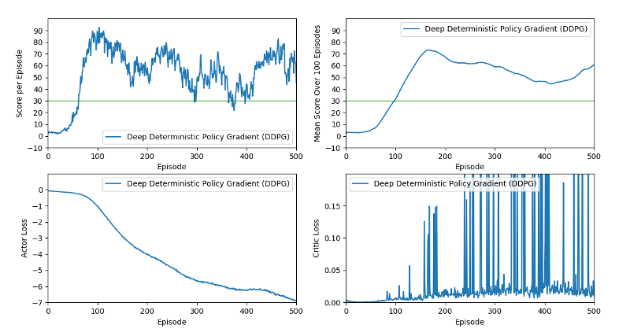

# Project Report

Author: Michael Aeberhard

This report summarizes the results of the second project, _Continuous Control_, of the Udacity Deep Reinforcement
Learning Nanodegree.

- [Project Report](#project-report)
  * [The Reacher Environment](#the-reacher-environment)
  * [Introduction to Policy-Based Methods](#introduction-to-policy-based-methods)
  * [Actor-Critic Methods](#actor-critic-methods)
    + [Advantage Actor-Critic (A2C)](#advantage-actor-critic--a2c-)
    + [Deep Deterministic Policy Gradient (DDPG)](#deep-deterministic-policy-gradient--ddpg-)
  * [Project Implementation Details](#project-implementation-details)
    + [Source Code Organization](#source-code-organization)
    + [Neural Network Architecture](#neural-network-architecture)
    + [Hyperparameters](#hyperparameters)
  * [Training Results](#training-results)
  * [Ideas for Future Work](#ideas-for-future-work)

## The Reacher Environment

For this project, an agent with a two-jointed arm is trained to move the end of its arm into a moving target position
represented by a sphere in space. For every time step that the arm is in the target position, a reward of +0.1 is
received. The input observation of the environment correspond to the position, rotation, velocity, and angular
velocities of the arm. The action space is a vector of four numbers between [-1, -1], which correspond to the applied
torque of the two joints.

The environment is considered solved when an average reward of at least +30 is received over 100 consecutive episodes.

The environment comes in two versions which can be used for inference and training:
* An environment with only a single agent.
* An environment with 20 identical and independent agents, which may be useful for gathering more experience during
  training.

## Introduction to Policy-Based Methods

The idea of policy based methods is to directly estimate the policy for the agent, versus first estimating the
action-value function and deriving a policy based off of it, as is done in value-based methods. Neural networks can
be used as function approximation for directly estimating the policy of an agent. Policies can either be deterministic
or stochastic, meaning that the output of the network is either an action-distribution from which an action is sampled
(stochastic), or the output is the action values directly (deterministic).

An advantage of using policy-based methods is that it easily enables the estimation of a policy for a continuous
action space, as the policy network can directly output a continuous value for a given action, whereas in Q-Networks,
an intermediate action-value is estimated (where actions are discrete values), from which a policy is derived.

Basic policy-based algorithms, such as REINFORCE, collect trajectories with a given horizon from the environment using
the current policy, and collect the reward at each step of this trajectory. The neural network's weights are then
adjusted using gradient ascent in proportion to the state-action's accumulated reward for the trajectory. However, it is
difficult to collect enough, independent trajectories to train a neural network efficiently. Additionally, the loss
function is a function of the complete trajectory, making it difficult for the network to effectively learn which
portion of the trajectory contributed to the positive or negative reward. Therefore, other policy-based methods have
been developed.

## Actor-Critic Methods

The basic idea behind actor-critic methods is to use two neural networks, one neural network which estimates the
agent's policy (the actor), and a second neural network which evaluates the "quality" of the current state and/or action
(the critic). Both neural networks are trained simultaneously, and during inference, only the actor network is used to
decide which action to take.

### Advantage Actor-Critic (A2C)

To improve upon the basic REINFORCE algorithm, a baseline function can be subtracted from the discounted reward used
to calculate the policy gradients. This serves to reduce variance while keeping the estimated policy unbiased. This
baseline, often known as a critic, can be estimated with a separate neural network which simply estimates the
state-value function for a given state. In REINFORCE, the actual discounted reward for a complete trajectory is used.
In [Advantage Actor-Critic (A2C)](https://arxiv.org/abs/1602.01783v2), the advantage function is
estimated using much smaller trajectories (even just a single time step), where future discounted reward is estimated
using the critic network's state-value estimate. This estimated advantage function is then used in the actor
network's loss function to weigh the action log probabilities and favor actions which maximize the advantage function.

### Deep Deterministic Policy Gradient (DDPG)

A2C is an on-policy method, which has some disadvantages for training converges. The
[Deep Deterministic Policy Gradient (DDPG)](https://arxiv.org/abs/1509.02971) algorithm is an off-policy method which is
closely related to Q-Learning and can be loosely thought of as a continuous action-space version of Q-Learning.
Both of the "tricks" in Q-Learning (replay buffer and target networks) are used in DDPG to achieve a more efficient
actor-critic method in terms of training efficiency.

As with Q-Learning, there are two versions of the actor-critic networks, the local networks which are currently being
trained, and the target networks which are kept constant for some time and used as a reference network when calculating
the TD error in the critic's loss function. Furthermore, each state, action, rewards and next-state tuple can be used
independently to train the network, allowing the use of a replay buffer, where random samples can be chosen in order to
avoid data dependency/correlation issues during training. The actor network is then trained such that the critic
network's value is maximized.

An important difference between DDPG and Q-Learning is that the critic network calculates state-action values directly,
i.e. the critic network takes both the state and the taken action as input, and output a single number representing
how good the action is for the given state.

Unlike A2C, the actor network is deterministic, meaning that it outputs actions values to be taken directly, instead
of a distribution to be sampled from. DDPG is an off-policy method, because like in Q-Learning, a policy which
balances exploration versus exploitation is used in order to interact with the environment during training. This is
accomplished by adding some noise to the actor network's output action values, accomplishing a similar effect as with
an epsilon-greedy policy in Q-Learning.

## Project Implementation Details

The Deep Q-Network agent is implemented in Python 3 using the deep learning framework [PyTorch](https://pytorch.org/).
The DDPG agent is heavily based on the implementation from the Udacity Deep Reinforcement Learning Nanodegree exercise examples, in particular [the example for solving the bipdeal
environment](https://github.com/udacity/deep-reinforcement-learning/tree/master/ddpg-bipedal). The 
[DeepRL GitHub repository](https://github.com/ShangtongZhang/DeepRL) was also often consulted, in particular for the
A2C implementation. The book
[Deep Reinforcement Learning Hands-On](https://www.packtpub.com/eu/data/deep-reinforcement-learning-hands-on-second-edition)
was also a helpful resource for understanding the algorithms and their implementations.

Note that the Unity ML-Agents reacher environment, as given, had to be modified such that the output reward from the
environment is +0.1 for any reward greater than 0, since the reward output from the Unity ML-Agents environment did not
match with the description of the project. Only with this modification was it possible to get the DDPG agent to
successfully learn an acceptable policy.

The following sections give a quick overview of the implementation used to solve the Reacher environment.

### Source Code Organization

The source code consists of four main modules which encapsulate concrete portions of the application:

* `reacher.py`: The main application which handles the command line user interface and contains the main
  training loop which plays an episode of the environment in every iteration and tallies the score of the agent's
  learning progress. It allows the execution of the environment for a single episode in inference mode.
* `environment/reacher_environment.py`: Encapsulates the Unity ML Agents reacher environment and exposes a similar
  simple API which is common in OpenAI Gym.
* `agent/ddpg_agent.py`: The DDPG agent which acts and learns from given state, action, reward and next-state
  information. This class contains all of the necessary data structures needed for the agent, including the local and
  target actor-critic networks, replay buffer, etc.
* `agent/network.py`: Implementation of the neural network using the PyTorch API.

Additionally, a unit test is provided in `reacher_test.py` which verifies the functionality of the
application in both single and multi-agent versions of the environment with a trained agent.

### Neural Network Architecture

Two neural networks are used in the DDPG agent, an actor network and a critic network.

The actor network is a simple neural network using linear nodes with Rectified Linear Units (ReLU) activation functions
for the input and hidden layers and a TanH activation function for the output layer, forcing the output values between
[-1, 1]. The architecture, which consists of four layers, is summarized below:

| Layer     | Size                    | Activation Function |
| --------- | ----------------------- | ------------------- |
| Input     | 33 (states)             | ReLu                |
| Hidden 1  | 256                     | ReLu                |
| Hidden 2  | 128                     | ReLu                |
| Output    | 4 (one for each action) | TanH                |

The critic network is also a simple neural network using linear nodes with Rectified Linear Units (ReLU) activation
functions. However, the action is input into the second layer of the network instead of concatenated together with the
state in the first layer. Furthermore, [batch normalization](https://arxiv.org/abs/1502.03167) is used on the second
input layer (first hidden layer) where the action values are concatenated to the output of the first input layer. The
architecture, which also consists of four layers, is summarized below:

| Layer     | Size              | Activation Function           |
| --------- | ----------------- | ----------------------------- |
| Input     | 33 (states)       | ReLu                          |
| Hidden 1  | 256 + 4 (actions) | ReLu with Batch Normalization |
| Hidden 2  | 128               | ReLu                          |
| Output    | 1 (Q-Value)       | -                             |

During training the local actor and critic networks are only updated after several time steps of interacting with the
environment. During a learning update, the actor and critic networks are update several times in a row, each time
using a different sample from the replay buffer.

### Hyperparameters

All hyperparameters, including the amount and size of the neural network's architectures, are contained in a single
Python file: `agent/hyperparameters.py`. The hyperparameters for the DDPG agent used in this project are summarized
in the table below.

| DDPG Hyperparameters                                             | Value     |
| ---------------------------------------------------------------- | --------- |
| Experience Replay Memory Size                                    | 1,000,000 |
| Training Mini-Batch Size                                         | 128       |
| Gamma (discount factor)                                          | 0.99      |
| Tau (soft update of target networks)                             | 0.001     |
| Actor Learning Rate                                              | 0.001     |
| Critic Learning Rate                                             | 0.0001    |
| Critic Weight Decay for L2 Regularization                        | 0.0001    |
| Gradient Clipping                                                | 1.0       |
| Steps Between Learning                                           | 20        |
| Learning Iterations per Update                                   | 10        |
| Epsilon Noise Factor Decay                                       | 1e-6      |
| Epsilon Noise Factor Start                                       | 1.0       |
| Epsilon Noise Factor End                                         | 0.05      |

## Training Results

The Deep Deterministic Policy Gradient (DDPG) agent was trained in the multi-agent version of the reacher environment
for a total of 500 episodes. It took __98__ episodes to solve the environment.

The plots below show the mean score over 100 episodes (calculated at each episode), the raw score of each episode, and
the actor and critic loss values during training. The required score of 30 for solving the environment is shown as a
green horizontal line.

Note that only the DDPG implementation was successful at solving the environment. The A2C algorithm, as implemented,
was not able to converge to a solution.

## Ideas for Future Work

The following are some ideas on how to potentially improve the agent's performance:

* Tune the hyperparameters and the neural network architecture. Currently the parameters are a pretty good initial guess
  for getting a working agent. However, more rigor could be used to find the optimal hyperparameters for the agent, for
  example using grid search. In particular the critic's loss is often a bit unstable; this would be a first area to
  investigate to improve the hyperparameters or improve the neural network's architecture.
* Implement other algorithm in order to compare performance, for example:
  * [Proximal Policy Optimization](https://arxiv.org/abs/1707.06347)
  * [Distributed Distributional Deterministic Policy Gradients (D4PG)](https://arxiv.org/abs/1804.08617)
