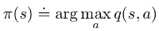
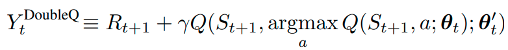

# Project Report

Author: Michael Aeberhard

This report summarizes the results of the first project, _Navigation_, of the Udacity Deep Reinforcement Learning
Nanodegree.

- [Project Report](#Project-Report)
  - [The Banana Navigation Environment](#The-Banana-Navigation-Environment)
  - [Introduction to Deep Q-Learning](#Introduction-to-Deep-Q-Learning)
  - [Deep Q-Network Improvements](#Deep-Q-Network-Improvements)
    - [Double DQN](#Double-DQN)
    - [Dueling DQN](#Dueling-DQN)
    - [Priority Experience Replay](#Priority-Experience-Replay)
  - [Project Implementation Details](#Project-Implementation-Details)
    - [Source Code Organization](#Source-Code-Organization)
    - [Neural Network Architecture](#Neural-Network-Architecture)
    - [Hyperparameters](#Hyperparameters)
  - [Training Results](#Training-Results)
  - [Ideas for Future Work](#Ideas-for-Future-Work)

## The Banana Navigation Environment

For this project, an agent is trained to navigate a large, square world with the goal of collecting bananas.

A reward of +1 is provided for collecting a yellow banana, and a reward of -1 is provided for collecting a blue banana.
Thus, the goal of the agent is to collect as many yellow bananas as possible while avoiding blue bananas.

The state space has 37 dimensions and contains the agent's velocity, along with ray-based perception of objects around
agent's forward direction.  Given this information, the agent has to learn how to best select actions.  Four discrete
actions are available, corresponding to:
- **`0`** - move forward.
- **`1`** - move backward.
- **`2`** - turn left.
- **`3`** - turn right.

The task is episodic, and in order to solve the environment, the agent must get an average score of +13 over 100
consecutive episodes.

## Introduction to Deep Q-Learning

The banana navigation environment is solved using a neural network Reinforcement Learning approach called Deep
Q-Learning. This approach is similar to traditional Q-Learning (or Sarsamax), which is a value-based method, where
Q-values (state-action values) of an environment are learned by interacting with the environment and the estimated
Q-values are updated based on the reward feedback from the environment. The Q-Learning update equation is

where the current Q-value is updated by a term which is called the temporal-difference (TD) error, which is the error
between the current Q-value estimate and the future expected cumulative reward for a given
state-action pair (i.e. the difference between the current reward plus the best state-action value for the next,
and the current state-action value estimate).

Once the state-action values have been learned, a policy can be executed which, given any state, will select the
action which corresponds to the maximum state-action value for that state.

While learning, a trade-off must be made between following the learned policy and exploring other actions in order to
potentially discover better states with higher reward. This is achieved by following a epsilon-greedy policy during
training, where a random action is chosen some percentage of the time. The epsilon value for choosing a random action
is usually chosen to be high at the beginning of training in order to encourage more exploration, and slowly decreased
during training to some minimum value.

In traditional Q-Learning, the state-action values are represented in a tabular data structure. This works well in
environments with a small and discrete state space. For a continuous state space, discretization may be used in order
to still represent the state space in a tabular form, but as soon as the dimensions of the state space increases, this
approach because computationally inefficient and potentially impossible. For the banana environment which needs to be
solved for this project, a continuous state space of 37 dimensions is given, which falls into the category of making it
challenging to solve this problem with traditional Q-Learning methods.

In a [Deep Q-Network](https://www.nature.com/articles/nature14236) (DQN) agent, a neural network is used as a function
approximator for translating on input state space to an output of state-action values. Typically for a given state, the
neural networks outputs a state-action value (Q-value) for all possible actions, of which the maximum state-action value
is chosen. Such a neural network in this context is called a Q-Network. The loss function for training such a network is
the mean square of the TD error w.r.t. to some target network.

There are two important differences to traditional Q-Learning that are applied in order to make Deep Q-Learning
practically feasible. One is that the target values in the TD error are calculated from a separate target Q-network
whose parameters are fixed for several learning iterations, where its parameters are updated regularly with the current
learned Q-network's parameters. This is done in order to avoid instabilities due to correlations between the learned
and target networks. Second is that the Q-networks parameters are not updated with the immediate experience while acting
on an environment, but rather it is updated using an experience replay buffer from which samples are drawn randomly,
effectively turning the reinforcement learning problem into a well studied supervised learning problem, where previous
experiences (the state, action, reward, and next-state tuple) become the "labels" for training. The final basic
Deep Q-Learning update equation for changing the neural network's weights is

where standard stochastic gradient descent from network backpropagation is used to train the network.

## Deep Q-Network Improvements

Some improvements can be made to the standard DQN update rule given above. Three such extensions were implemented in
this project's solution and compared / combined with one another to experiment with what gives the best results in the
banana environment. A brief description of these extensions is given below.

### Double DQN

In the basic Deep Q-Learning algorithm, the target network's Q-values are used to both select and estimate the
Q-values in the TD error term. This can lead to over-optimistic estimates of the Q-values. The goal of
[Double DQN](https://arxiv.org/abs/1509.06461) is to de-couple the action-selection of the target network and the
evaluation of the state-action values. Instead of using the target network's Q-values to selection the action in the
argmax operator, the current "online", or "local", Q-Network's parameters are used to evaluate Q-Values for a given
state for the purpose of action selection in the next state for the target network. Once the action is selected, the
Q-values for the next state, however, are still estimated using the target network's parameters. The equation for the
target network's Q-value evaluation in Double Q-Learning is given below:

### Dueling DQN

The [Dueling Deep Q-Network](https://arxiv.org/abs/1511.06581) makes a slight modification in the late fully connected
layers of a neural network, as shown below:

The basic DQN network is shown in the top part of the figure and the dueling DQN architecture in the bottom part.
Instead of learning the state-action values, the dueling network separately learns the state value function as well
as the advantage function, defined as

where the state-action value is simply the sum of the advantage function and the state-value function. This architecture
enables the learning of the state value function, which is independent of any action taken, allowing the network to
learn if it is valuable to be in a given state, regardless of the action taken from that state. For the banana
navigation environment, this could for example be the difference between choosing action left or right, where in some
cases it does not matter which action is taken, i.e. to avoid a blue banana.

### Priority Experience Replay

The experience replay mechanism in the basic DQN algorithm samples uniformly from the experience buffer. However,
this may be sub-optimal, since some experience are more valuable than others in terms of learning. The method of
[Prioritzed Experience Replay](https://arxiv.org/abs/1511.05952) makes an improvement in this regard by using a priority
mechanism for sampling experiences in a non-uniform manner. Usually, the TD error is used an indication of experience
importance for prioritization. Samples are then chosen according to a sampling probability defined by

where alpha is a hyperparameter which controls how strongly the priority should be considered in sampling (alpha = 0 is
equivalent to uniform sampling). The intuition is that learning will focus on the more important experiences, therefore
improving convergence dynamics during training.

## Project Implementation Details

The Deep Q-Network agent is implemented in Python 3 using the deep learning framework [PyTorch](https://pytorch.org/).
The initial implementation of the Q-Network, the DQN Agent, as well as the training loop, is borrowed from the Udacity
Deep Reinforcement Learning Nanodegree exercise examples, in particular [the example for solving the Lunar Lander
environment](https://github.com/udacity/deep-reinforcement-learning/tree/master/dqn). Some implementation hints were
from the
[Deep Reinforcement Learning Hands-On](https://www.packtpub.com/eu/data/deep-reinforcement-learning-hands-on-second-edition)
book were also used. The following sections describe the implementation in more detail.

### Source Code Organization

The source code consists of four main modules which encapsulate concrete portions of the application:

* `banana_navigation.py`: The main application which handles the command line user interface and contains the main
  training loop which plays an episode of the environment in every iteration and tallies the score of the agent's
  learning progress. It allows the execution of the environment for a single episode in inference or manual mode.
* `environment/banana_environment.py`: Encapsulates the Unity ML Agents banana environment and exposes a similar simple
  API which is common in OpenAI Gym.
* `agent/dqn_agent.py`: The Agent interface which acts and learns from given state, action, reward and next-state
  information. This class contains all of the necessary data structures needed for the agent, including the local and
  target Q-Network, replay buffer, etc.
* `agent/q_network.py`: Implementation of the neural network using the PyTorch API.
* `agent/replay_buffers.py`: Implementation of the experience replay buffers.

Additionally, a unit test is provided in `banana_navigation_test.py` which verifies the functionality of the
application.

### Neural Network Architecture

A simple neural network using linear nodes and Rectified Linear Units (ReLU) activation functions is implemented.
The architecture, which consists of four layers, is summarized below:

| Layer     | Size                    |
| --------- | ----------------------- |
| Input     | 37                      |
| Hidden 1  | 64                      |
| Hidden 2  | 64                      |
| Output    | 4 (one for each action) |

The four output values of the network represent the Q-values for each possible action.

### Hyperparameters

All hyperparameters, including the amount and size of the neural network's architectures, are contained in a single
Python file: `agent/hyperparameters.py`. The hyperparameters used for the experiments for this project are summarized
in the table below.

| Hyperparameter                                                   | Value  |
| ---------------------------------------------------------------- | ------ |
| Experience Replay Memory Size                                    | 100000 |
| Training Mini-Batch Size                                         | 64     |
| Gamma (discount factor)                                          | 0.99   |
| Tau (soft update of target network)                              | 1e-3   |
| Learning Rate                                                    | 5e-4   |
| Q-Network Update Interval                                        | 4      |
| Alpha (Priority Experience Replay only)                          | 0.6    |
| Beta Initial (Priority Experience Replay only)                   | 0.6    |
| Beta Episode Annealing to 1.0 (Priority Experience Replay only)  | 500    |

## Training Results

The DQN agent was trained in the banana navigation environment using five different variants of the algorithm, all with
the hyperparameters described above. The number of episodes required to solve the environment (a mean score of 13 for 100
consecutive episodes), along with the weights file for the trained network, is shown in the table below.

| DQN Algorithm                        | Episodes to Solve  | Weights File                   |
| ------------------------------------ | -------------------| ------------------------------ |
| Basic DQN                            | 470                | `weights.pth`                  |
| Double DQN                           | 508                | `weights_double.pth`           |
| Dueling DQN                          | 523                | `weights_dueling.pth`          |
| DQN with Priority Experience Replay  | 587                | `weights_priority_replay.pth`  |
| Double + Dueling DQN                 | 471                | `weights_double_dueling.pth`   |

Oddly enough, the basic DQN algorithm without any extensions performed the best in terms of convergence to solve the
environment. Only the combination of Double DQN and Dueling DQN was able to solve the environment in roughly the same
amount of episodes.

The plot below shows the score per episode as well as the mean score over 100 episodes throughout the training process
(with a total of 1,000 episodes) for each of the algorithm variants.

At the end of training, all algorithm variants converge to achieving a mean score over 100 episodes of roughly 16.

The banana navigation environment itself may be too simple of an environment to warrant much of a difference between the
DQN algorithm variants, which could be an explanation for the roughly similar convergence dynamics during the training
process. It is also important to note that the Priority Experience Replay implementation is quite slow since a deque
data structure was used instead of something more efficient like the sum-tree, as suggested in the paper. Furthermore,
it is still possible that the implementation for the extended algorithms is not 100% correct, which could also be an
explanation for the lower performance w.r.t. the basic DQN algorithm.

## Ideas for Future Work

Since the DQN extensions implemented did not perform much better than the basic DQN algorithm, some time could be
invested in finding better hyperparameters and network architectures so that the algorithms all have a fair chance at
achieving their best performance. This could be done using a grid-search, or something like
[Auto-ML](https://en.wikipedia.org/wiki/Automated_machine_learning) or
[Neural Architecture Search](https://en.wikipedia.org/wiki/Neural_architecture_search) to optimize the hyperparameters
as well as the architecture.

There are also additional extensions to the DQN algorithm that have been proposed, all of which have also been combined
together in an approach called [Rainbow DQN](https://arxiv.org/abs/1710.02298). The current implementation could be
further extended with these other extensions, such as Noisy DQN, multi-step bootstrapping, Distributional DQN.
Similarly as done above, these different extensions and their combinations can then be evaluated to find out which
approach has the best convergence dynamics during the training process.

Furthermore, there is a version of the banana environment in which the input state space is simply the raw image pixels.
A [deep convolutional neural network](https://en.wikipedia.org/wiki/Convolutional_neural_network) could be trained to
solve the banana environment directly using the image data as input, although it is expected that the training process
will take much longer with such a neural network.